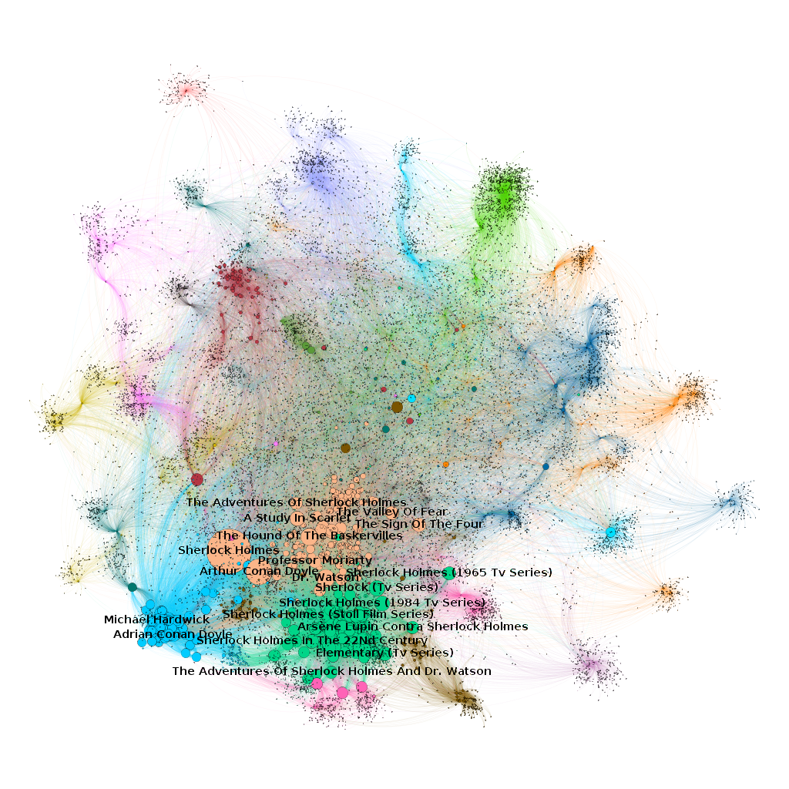
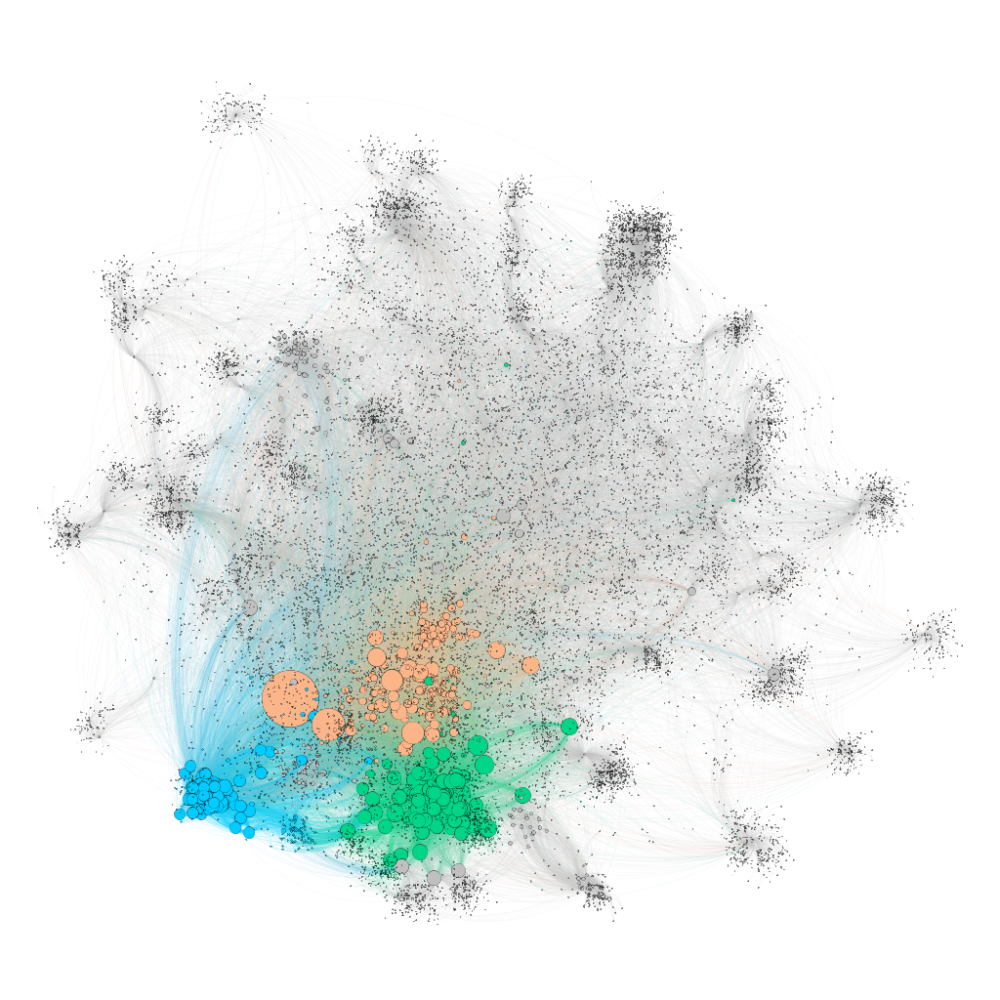

# Sherlock Holmes's Network

This work has as purpose to analyze the Sherlock Holmes's network created from the Wikipedia page.

Work of undergraduate course about Network Analysis (IMD1155) of Bachelor's degree in Information Technology from the Federal University of Rio Grande do Norte (UFRN), with [Ivanovitch Medeiros Dantas da Silva](https://github.com/ivanovitchm) as professor.

Group:
- [Álvaro Ferreira Pires de Paiva](https://github.com/alvarofpp)
  - Enrolment: 2016039162
  - E-mail: alvarofepipa@gmail.com
- [Marcos Vinícius Rêgo Freire](https://github.com/mvinnicius22)
  - Enrolment: 20210053533
  - E-mail: mvinnicius22@hotmail.com

## Network

The network was generated from https://en.wikipedia.org/wiki/Sherlock_Holmes using snowballing process (filtered with 2 or more degree). You can find the algorithm in [`alvarofpp/dataset-network-from-wikipedia`](https://github.com/alvarofpp/dataset-network-from-wikipedia). It has 20773 nodes and 114313 edges.

We use [Gephi](https://gephi.org/) to analyze the network and generate some reports:

- Degree Report:
  - Average Degree: 5.503
- Graph Distance Report:
  - Diameter: 7
  - Radius: 0
  - Average Path Length: 3.129190067981233
- Modularity Report:
  - Modularity: 0.635
  - Modularity With Resolution: 0.635
  - Number of Communities: 19
- Connected Components Report:
  - Number of Weakly Connected Components: 1
  - Number of Strongly Connected Components: 20033

| Community | Percent | Rank by percent |
| --- | --- | --- |
| 0 | 1.84 | 17 |
| 1 | 7.97 | 4 |
| 2 | 3.77 | 13 |
| 3 | 7.29 | 6 |
| 4 | 2.05 | 16 |
| 5 | 1.38 | 18 |
| 6 | 5.69 | 9 |
| 7 | 5.11 | 10 |
| 8 | 5.01 | 11 |
| 9 | 6.96 | 7 |
| 10 | 3.70 | 14 |
| 11 | 5.72 | 8 |
| 12 | 9.34 | 2 |
| 13 | 4.74 | 12 |
| 14 | 8.38 | 3 |
| 15 | 2.73 | 15 |
| 16 | 9.68 | 1 |
| 17 | 0.91 | 19 |
| 18 | 7.72 | 5 |

Fun fact: the communities with nodes of the highest degree (3, 9 and 10) are not the communities with the highest number of nodes.

